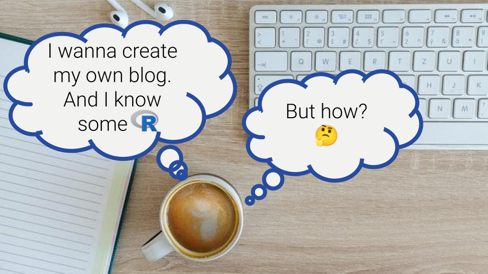
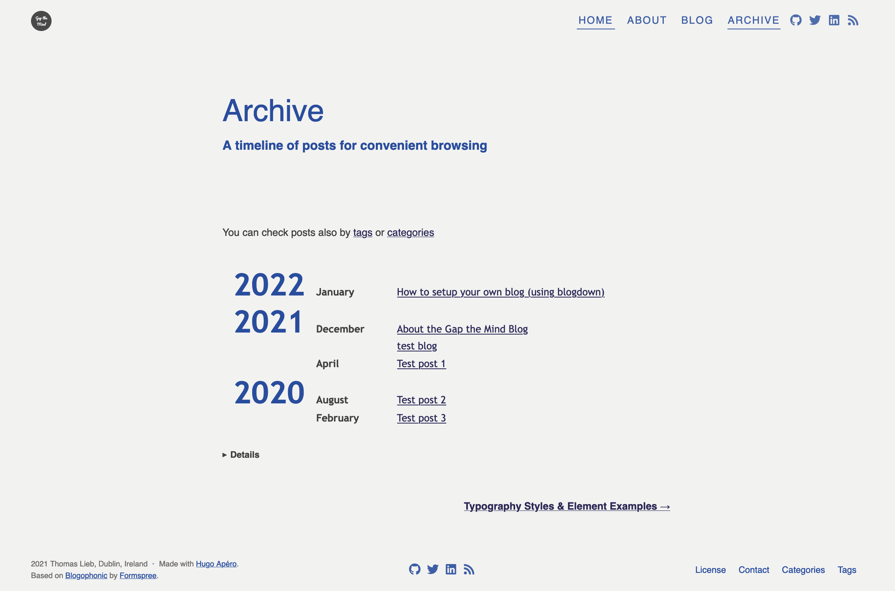

**TLDR**: 


<p style="color:grey; font-size:0.7em; margin:0;">
Original photo by <a href="https://unsplash.com/@goumbik?utm_source=unsplash&utm_medium=referral&utm_content=creditCopyText" target="_blank">Lukas Blazek</a> on <a href="https://unsplash.com/s/photos/blog?utm_source=unsplash&utm_medium=referral&utm_content=creditCopyText" target="_blank">Unsplash</a>.
</p>

## Motivation

You might ask yourself, why create a blog in the first place? Well, it depends on your interests and motivations. Here's a brief intro to my story:

I always thought that it would be a great project to create a blog to write about topics I am passionate about and want to share with other people. I find it very beneficial for my learning and thought process to write about topics of interest to me. It forces me to put a structure around it, think about how to explain it to others and fill in gaps.

Moreover, I regularly came across interesting projects to make website building easy and fun. That is most importantly the R package [blogdown](https://bookdown.org/yihui/blogdown/). To me, creating a blog using blogdown comes with a bunch of benefits:

-   Create a blog powered -- amongst others -- by R. That is, I can use my favourite [IDE (Integrated Development Environment)](https://en.wikipedia.org/wiki/Integrated_development_environment) [Rstudio](https://www.rstudio.com/), I can integrate R code in my blog and I can benefit from the supportive R community.
-   Use git version control with all its advantages like branching along with free hosting of all my code on [Github](https://github.com/rietho/blogdown_website).
-   Benefit from all the tooling blogdown is powered by, such as the static website generator [Hugo](https://gohugo.io/) as well as tools like [Netlify](https://www.netlify.com/) for publishing.


## How to get started

To get started with your own blog, you need to make some decisions to establish which path to go with. Ideally, first, you get an understanding of why you want to create a blog and your vision for it. This will be a useful guide throughout the entire process.

### Create your own blog?

#### Non-technical route

You do not actually need to create your own blog to blog. There are many free sites where you can sign up and use existing infrastructure to blog. Several sites are focusing on specific topic areas coming with the benefit of an already existing community. And many of these sites require little to no technical knowledge. Thus, pretty much everyone with internet access can start blogging today. Here's one of many [overviews of blogging websites](https://www.techradar.com/news/the-best-free-blogging-sites).

I for example created a [blog in 2011 about my semester abroad in San Diego, CA, USA](http://tratsd.blogspot.com/). I wanted something with minimal effort, so I went with Blogspot, which got rebranded [Blogger](https://www.blogger.com/). And no worries, blogs created today with Blogger look way better than my "ancient" blog from 2011.

#### Technical route

For me building the blog itself was part of the motivation, so I went that route. There are lots of different tools out there. A lot of them use simple drag and drop UIs. Many of them can be used for free, but with limited features. You can create a blog also programmatically using one of the existing packages to automate the steps involved. I wanted to do something with R. Given that, the most popular packages seemed to be [blogdown](https://bookdown.org/yihui/blogdown/) and [distill](https://rstudio.github.io/distill/). Both are quite similar, however, blogdown seems to give you more freedom in tweaking the website, whilst distill seems to have a higher level of automation and thus, is easier to use. @WeAreRLadies tweeted a quick comparison:



## Using blogdown

Blogdown comes with a very handy [website](https://bookdown.org/yihui/blogdown/) explaining pretty much everything you’ll need to know. Blogdown creates a static website for you using the popular static site generator Hugo. Static websites deliver the website to the user as it is stored on the server. Thus, every user sees the same content. See [Wikipedia](https://en.wikipedia.org/wiki/Static_web_page) for more info.

After reading about blogdown, the first action you’re encouraged to take is to decide on a theme. The theme will largely determine the look and feel of your site along with which features will be at your disposal. You can explore a lot of themes at https://themes.gohugo.io/. I personally went for the Hugo Apéro theme ([Github](https://github.com/apreshill/apero), [demo site](https://hugo-apero.netlify.app/), [docs](https://hugo-apero-docs.netlify.app/start/)) which was built by [Alison Presmanes Hill](https://www.apreshill.com/) and several other contributors. I did so because I liked the modern look and feel and as it is coming with several useful features like customisation options or comments.

After you pick a theme, you can follow [the recommended workflow](https://bookdown.org/yihui/blogdown/workflow.html) to create your website, push it to Github and even deploy it on Netlify.

It’s also worth mentioning that the Hugo Apéro documentation has a great [step by step tutorial](https://hugo-apero-docs.netlify.app/start/) to get your blog up and running. Even though the tutorial is specific to the Hugo Apéro theme, I think it’s pretty straightforward to apply to any Hugo theme.

Lastly, I should mention the [Hugo documentation](https://gohugo.io/documentation/). Hugo is quite powerful and if you're looking for more control over your website, this is a good place to start.

## Further customisations

Following the above guides, you’re pretty much done with creating your own beautiful blog. So, you’d be ready to create content. However, there are many ways you can customise your blog. Here, I want to point out some aspects where I needed further research to find out.

### Commenting

You may want to enable readers of your blog to comment on your posts. Many themes, including the Apéro theme, have commenting features built-in. These themes leverage third-party tools which are embedded in your blog. The Apéro theme allows for comments using Utterances or Disqus.

* **[Utterances](https://utteranc.es/)** is lightweight, completely free and uses Github issues in the background. For commenting a Github account is needed. So it seems ideal if you can expect the majority of your readers to have a Github account anyway. But even if not, creating a Github account is free. The Apéro theme has a section `params.utterances` in the *config.toml*-file for configuration.
* **[Disqus](https://disqus.com/)** offers to comment with lots of features. However, the free option comes with ads and core features only. One of the positives is that they offer multiple ways for users to identify themselves. This includes popular social media accounts and optionally also unregistered guest commenters. If you want to use Disqus, you need to sign up, create a Disqus site that represents your blog and set the `disqusShortname` parameter in *config.toml* to the Disqus short name. Don't forget to set `use_utterances` to `false` and you should be good to go.

I personally wanted to start with Disqus as I expect to have a significant number of my readers not to have a Github account. However, I found the ads that come with Disqus to be of low quality which I did not want to have on my blog. [According to Disqus](https://help.disqus.com/en/articles/1717307-subscription-payments-faq) advertising is optional for "personal blogs, .edu sites, and non-profits". However, even after some googling, I could not find how to make use of that policy. Thus, I went with Utterances.

### Overview pages

Your post comes with a lot of metadata which is very useful for users to navigate your blog and for search engines to process your blog. You can also create a taxonomy of your pages via providing `tags`, `categories` or [other custom taxonomies](https://gohugo.io/content-management/taxonomies/). 
You may also collect posts via a `series`. For these taxonomies, many themes, including the Apéro theme (maybe all themes do?),  automatically provide an overview page for each taxonomy. You can access them via `<your_base_url>/tag` / `<your_base_url>/categories` / `*<your_base_url>/series` (replace `<your_base_url>` with your base URL). You can easily link these in your header/footer. For example, I linked the tags overview page in the footer by placing the following under `[menu]` in *config.toml*:

```toml
  [[menu.footer]]
    name = "Tags"
    title = "Tags"
    url = "/tags/"
    weight = 4
```

### Archive page

I do like the idea of an archive page providing readers with a quick and easy chronological overview of all blog posts. Some themes do come with an archive page, but the Apéro theme does not seem to do so. At least I couldn’t find it. So, I built an archive page on my own which you are welcome to reuse:

Here blogdown comes in handy, as I can use [R markdown](https://rmarkdown.rstudio.com/) to programmatically create content. I created a folder `archive` within the `content` folder and placed an `index.Rmd` file in there. You can find the code of the current live version on Github:

* file [`/content/archive/index.Rmd`](https://github.com/rietho/blogdown_website/blob/main/content/archive/index.Rmd)
* file [`R/functions.R`](https://github.com/rietho/blogdown_website/blob/main/R/functions.R) where I saved some functions I wrote to help with the archive page

In theory, you should be able to simply copy these files as they are. The code is not perfectly clean, but it should work well.

The basic idea is the following:

* extract the yaml sections of all pages
* filter down to non-draft blog posts
* extract the information needed for the archive page: `title, link, year, month, slug`
* clean up the data frame for being displayed as a table
* format and display the archive as a table

The R markdown files need to be rendered before deployment. Netlify does not render them for you. In any way, it's easy to do so locally either via the following R code

```r
blogdown::build_site(run_hugo = F, build_rmd = T)
```

or via modifying and saving the script while locally serving the site (`blogdown::serve_site()`).

Once the R markdown file is rendered, you can place it for example in your header via:

```toml
  [[menu.header]]
    name = "Archive"
    title = "Archive"
    url = "/archive/"
    weight = 4
```

I should also point out that my code relies on each post having `title`, `date` and `slug` defined in the metadata. That is because I defined the following permalink structure for blogs in `config.toml`:

```toml
[permalinks]
  blog = "blog/:year/:month/:day/:slug/"
```

If one of the needed entries is not present, the R code throws an error. If you use a different link structure, adjust the code where it says ` # adjust if permalink changes`.

Finally, here's an example screenshot of an Archive page:



### Using your own domain

In case you are using Netlify, you end up with a link that looks something like `name-of-your-blog.netlify.app`. That itself maybe everything you need. But you may want to have your blog online on a custom domain. Read more about domains [here](https://bookdown.org/yihui/blogdown/domain-name.html). In that case, you might want to buy a domain. Depending on the domain, the cost itself starts from around 10$/year. There are a bunch of domain registrars where you can buy them. On choosing one watch out for potential hidden costs you might get charged.

I was using [Cloudflare] to buy my domain, as they are offering free CNAME flattening. This includes that my blog can be reached via https://gapthemind.info (i.e. the `www` can be omitted). Both Cloudflare and Netlify need to be configured to work together. It took me a bit to figure out how, but [here](https://jaketrent.com/post/cloudflare-dns-netlify-host)'s a nice blog post illustrating the steps.

### Licencing of Images, GIFs, Videos and Memes on your blog

> Disclaimer: Nothing I say/write here is legal advice. I do my best to not be wrong, but there's no guarantee.

When writing blog posts, you might want to embed images, GIFs, videos or memes. I think embedding such content is a great way of loosening up your text, making it more engaging or introducing some fun. However, you do want to keep it legal by using only material that you have permission to use. Often, the material comes with a licence that defines if, how and under which conditions you may or may not use the content.

There are websites to get visual content from for free. Other sites require you to pay. Here are some resources I found to be useful. I'll share my understanding of the licensing. But again, this is no legal advice and I might be wrong. Also, licences can change over time.

* [Unsplash](https://unsplash.com/): Unsplash is a great archive for stock photos. Their photos are free to use. But be sure to check out their nicely readable [licence page](https://unsplash.com/license). And even if you do not need to attribute Unsplash or the creator, I think it is very respectful to do so.
* [Giphy](https://giphy.com/): Giphy is a great page for GIFs. It is my understanding that Giphy allows you to use their GIFs freely as authorised by their service. For example, they offer embedding GIFs. But as users can upload content to Giphy, in general, you can't be sure that there are no copyright issues. Also, laws in the country you are located in might affect what you can or can't do.
* [Imgflip](https://imgflip.com/): I like Imgflip for generating memes. According to their [terms of service](https://imgflip.com/terms), you can link to their memes, but need to link back to their site. Similar to Giphy, Imgflip allows users to upload content. So copyright issues might still arise.
* [Youtube](https://www.youtube.com/): For most videos on Youtube, you can get HTML code to embed the video in your post. It is my understanding that Youtube videos can be embedded without the need to ask for permission. But again, users upload content, so copyright issues could emerge. Also, it's likely a good idea to read Youtube's term of service.
* Your own photos: You can of course simply use your own photos. As far as I know, it's still important to watch out for what's visible in your photo. For example, there might be country-specific limitations on other people being visible or on any other copyrighted material being visible.

As you can see, licensing is not an easy topic. Just writing about it, gives me a headache. But I think it is worth it to invest some time in where to get your content from and what you can or can't do with that content. With that, you're hopefully on the safe side and can focus again on blogging :smile:

## Summing things up

There are many options for how you can create your own blog. With `blogdown` you have a nice R package at your disposal giving you lots of options on how to customise the look and feel of your blog. You can even use R markdown to generate content. In any case, I hope you find this post helpful.

Happy blogging!
