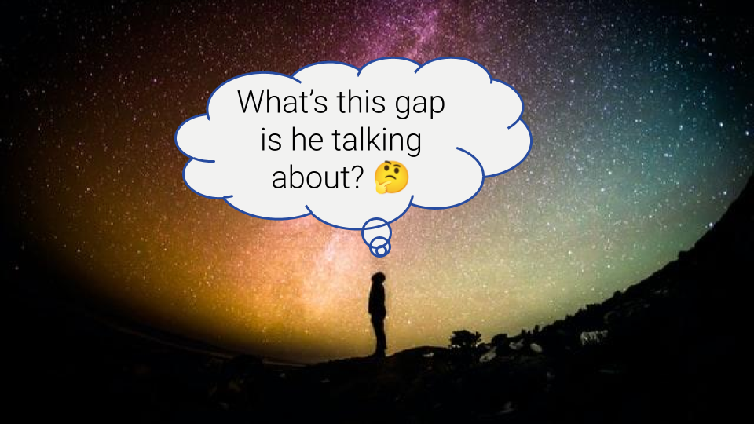

**TLDR**: 

## Motivation

Original photo by  <a href="https://unsplash.com/@grakozy?utm_source=unsplash&utm_medium=referral&utm_content=creditCopyText" target="_blank">Greg Rakozy</a> on <a href="https://unsplash.com/s/photos/blog?utm_source=unsplash&utm_medium=referral&utm_content=creditCopyText" target="_blank">Unsplash</a>.

For me, as for many other people, writing about topics I’m interested in, helps me get a deeper understanding of them. I love sharing and discussing these topics with others. Thus, I’m not just writing for myself, but with an audience in mind. Explaining things to others helps me to understand where I have knowledge gaps and to fill them. And ultimately, sharing with others makes my knowledge accessible and thus, hopefully even helpful for others. All of that, along with the fun of [creating a blog and doing so with R](/blog/2022/01/01/how-to-set-up-your-own-blog-using-r-and-blogdown/), is enough reason for me to write this blog.

## About the blog name

There are 6 great reasons why the name of this blog is "Gap the Mind". These relate to the topics I wanna write about, but they are also pragmatic. And, to be honest, some of the reasons occurred to me after I found the name.

1. **This blog is about gaps and the mind** 
  The topics I wanna write about are all, at least in the wider sense, about gaps and the mind. But to summarise it here: Gaps to bridge are everywhere. And in today’s world, we like to use our minds to solve pretty much every problem, even if our mind might not be the right tool for the problem.

2. **The name originates from "Mind the Gap"** -- surprise :astonished: --, **but often things are upside down** 
  “Mind the Gap” refers to many things. There are literal gaps in the physical world like in the underground and also mental gaps, often between what somebody means and what others understand. Ideally, we wanna mind these gaps. In any way, it is important to be at least aware of them and ideally not fall into them. At the same time, things are often mixed up. 
  Let's say a person named Gary is misunderstood by his friend and argues that it’s the fault of his friend. Seems like an understanding gap. Garry thinks his friend did understand his words in a “wrong” way. And Gary’s friend might say that Gary said the “wrong” words. 
  "Mind the gap" also does remind me of Bréne Brown's book [Daring Greatly](https://brenebrown.com/book/daring-greatly/). There she refers to value gaps. We all have personal values like honesty, kindness or courage. Adhering to our values 100% of the time is unrealistic. But it is helpful to be mindful of the gaps between our values and what we actually do.

3. **Mind the Gap” is used very often already.** 
  Originally I thought about naming the blog "Mind the Gap". But too many blogs and sites use this name already. So, I simply needed something else.

4. **Mindfulness** 
  Early 2021, I started getting interested in [Mindfulness](https://en.wikipedia.org/wiki/Mindfulness). One way, I like to think of Mindfulness as training of my mind and brain helping me to be mindful where needed. Obviously, we wanna be mindful of gaps that we don’t want to miss. But Mindfulness is actually about using more than just your mind. It’s about using your senses and being aware of emotions and feelings as they arise. In some sense, Mindfulness is not at all about minding gaps. Here, I’m referring to gaps in the sense of the difference between where we are and where we wanna be. Mindfulness is more about being aware of where we are right now.

5. **Gap the mind** 
  I'd like to define "gap the mind" for me as "bridge the gap from the mind". So, a gap to bridge from the mind to something else. And there are many gaps between our minds and other things. For example between the mind and our emotions, our actions, our words, other peoples perception, how much we get done and so on. In the next section, I write more about examples from the specific domains I wanna blog about.

6. **The domain is already bought** 
  As I figured "gap the mind" is a good enough name, I just went with it and bought the domain `gapthemind.info`. `.info`, because it was one of the cheapest [top level domains](https://en.wikipedia.org/wiki/Top-level_domain). And now that it is bought, I wanna think that [I went for the best option](https://en.wikipedia.org/wiki/Choice-supportive_bias).

And to give credit where it is due: It was actually my wonderful wife that first suggested the name “mind the gap”.

To summarise, why I chose this blog name:

<a href="https://imgflip.com/memegenerator" target="_blank">from Imgflip Meme Generator</a>

## What this blog is about

The main topics I want to write about are data science, management and mental health. Each of these topics is very broad for itself. Thus, I'd like to give you a glimpse into how I am thinking about these topics.

### Data Science

The term Data Science does not have a clear definition. I do like the definition used by Google's Chief Decision Scientist Cassie Kozyrkov:

> Data Science is the discipline of making data useful ([source](https://www.youtube.com/watch?v=I6XbLIRa0v0))

You might wonder what qualifies me to write about Data Science: Apart from my degree in statistics, at the time of writing, I am working in [Business Intelligence (BI)](https://en.wikipedia.org/wiki/Business_intelligence) at  [Indeed](https://indeed.com). BI is often used to help a business make decisions using data. Depending on the company, BI is making use of all the Data Science sub-disciplines: Analytics, Machine Learning (ML) and Artificial Intelligence (AI) as well as Statistics. In my case, I am touching on pretty much all aspects of Data Science day by day. In this blog, I will refer to "Data Science" as all aspects of making data useful.

I am not yet sure about which topics and aspects of Data Science I want to write about. To start, I wanna cover topics that are not strictly Data Science, but closely related: About my experience on creating this blog using R as well as about building a data-driven CV using R. Beyond that, there are many topics I can think of:

* What makes up a great Data Scientist?: There are many skills involved beyond pure technical ones.
* Biases in Data Science: There are many to watch out for. And many can creep in in all stages of a Data Science project.
* What does it take to even get started with Data Science?: There's a lot more involved than pure Data Science like data availability.
* What does it means to be a Data Scientist beyond Data Science?: Being a Data Scientist involves a lot more than doing Data Science. Even beyond the broad range of skill set mental aspects like Fear of Missing Out (FOMO) or Imposter Syndrome play a role.

Just be mindful, that data scientists might sometimes life in their own world :wink:

<a href="https://imgflip.com/memegenerator" target="_blank">from Imgflip Meme Generator</a>

### Management

By management, I am referring to managing a team. Managing a team comes with a wide range of responsibilities. This can vary by company and organisation, but I think has some truth no matter where. As a manager, you are likely to be, amongst others, be responsible for guiding and coaching individuals, career conversations, performance reviews, team meetings, project acquisition, prioritisation, stakeholder management, strategic planning, budgeting, compensation and so on.

At the time of writing, I am at the start of my personal path in management. And I am fascinated by all the skills involved in being a good manager. A lot of it seems to me to be about influencing others like your team, stakeholders, or upper management. But a huge part seems also to be about managing yourself as a manager. That involves things like time management, your priorities, your stress level, your well-being and your own emotions. That is quite broad. And even though my education and career so far has been very technical, I have always had an interest in these "soft skills". For me, this resulted in a degree in mediation, negotiation, communication and conflict management.

Currently, I am reading quite a bit about management. At the same time, I am trying different things out in practice. Thus, don't expect my posts on that topic to be drawn from ten's of years of experience in management. Instead, I am approaching this topic from a perspective of learning, practising and genuine interest. Also here, there are many topics I can think of writing. I do not have super concrete blog post ideas yet. However, here are some topics I can think of. This is also a good place for my future self to look for inspiration ;)

* Moving from individual contributor to manager
* How to not get burned out as a manager
* Putting learnings from books like *Radical Candor* into practice
* Mindful management (good overlapping topic with mental health)

I consider management a very serious job. It's a big responsibility, as it can affect employees a lot in good but also bad ways. That is, the saying "choose your manager, not the job" does exist for a reason. And unfortunately there seem to be a lot of examples about bad management out there. At least, there are enough jokes about bad management:

<a href="https://imgflip.com/memegenerator" target="_blank">from Imgflip Meme Generator</a>

### Mental Health

Last, but not least, I want to blog about mental health. Mental health is a very broad topic that is in my understanding gaining more and more awareness. Here's how the [WHO](https://www.who.int/en/news-room/fact-sheets/detail/mental-health-strengthening-our-response) describes mental health:

> Mental health is a state of well-being in which an individual realizes his or her own abilities, can cope with the normal stresses of life, can work productively and can make a contribution to his or her community.

So, contrary to a still widespread belief, mental health is a lot more "than the absence of mental disorders" ([WHO](https://www.who.int/en/news-room/fact-sheets/detail/mental-health-strengthening-our-response)). To me, a keyword concerning mental health is *well-being*. And that is not just short term well-being, but maybe much more important the long term well-being. I feel in our modern world there are too many things that make us feel good in the short term, but can far too easily add up to a very negative effect on us in the long term. A lot of these topics are very well known. That is for example social media, consumption, focus on performance, the desire of fitting in and so on. And there are way too many things that we as a society do to others, that are very damaging for mental health. Things like peer pressure, stereotypes, social classes, xenophobia, racism and all sorts of other hostile attitudes come to mind.

I have many personal encounters and stories with mental health. And I intend to share some of these in my blog posts. Here I wanna say that I came to believe that mental health is one of the most precious things we as humans have in our life. That is maybe even more important than physical health, while they influence each other quite a lot. 

The one topic I got specifically highly interested in in the last year, is Mindfulness. To me, mindfulness is far more than "just" a meditation practice. I see it as a very powerful skill and mindset. Mindfulness helped me a lot in making progress in various areas like

* getting to know me better,
* increasing awareness of my emotions as they arise,
* listening to the needs of my body,
* enjoying the beauty of the present moment,
* handling unpleasant things in life,
* being empathetic, compassionate and kind towards others but also myself,
* or knowing and feeling that I am good enough the way I am.

Mindfulness may sound somewhat esoteric. In fact, mindfulness does get abused by monetary interests or entangled with New Age beliefs. To be honest, I was quite sceptical when introduced to mindfulness. It is by no means a one-size-fits-all solution. But in my experience, it is a very practical approach in getting in touch with a part of ourselves that is very easy to lose touch with.

As I walk my mindfulness path, there are a bunch of topics I want to write about. That is to deepen my understanding of these topics and share them with however might be interested:

* What is mindfulness anyway and why you might want to care
* Mindfulness beyond meditation: Mindfulness in the daily life
* Emotions and signals from your body as messages you don't want to miss
* Ideas around happiness and contentment
* Insights into how our mind works
* How we can harm ourselves with things like perfectionism, high expectations, language or shame.

Just be mindful, that it is very easy to misunderstand things:

<a href="https://imgflip.com/memegenerator" target="_blank">from Imgflip Meme Generator</a>

### To consider when reading my posts

As you might guess, the topics I just described have quite a bit of overlap. Just think about a data science manager thinking about the mental health of her team. In that sense, you'll likely see posts touching on multiple topics at once.

In addition, I wanna be clear about the following:

* I am sharing my personal opinion. At the same time, I do some research and link it where appropriate.
* I do not claim to know the truth. I write about how I make sense of things based on my experience, conversations with others and my reading.
* I am more than happy to discuss the content of my pots. Depending on the volume and my time availability, I might not engage in every discussion. At the same time, I love to hear about other peoples perspectives. And I am very happy to be proven wrong, as that would mean that I learned something.

## Where we might wanna <i>gap the mind</i>

Now you know why I named this blog *Gap the Mind*. Hopefully, you also have a good sense of the topics I envision covering. What's left, is to shed some light on how all these relate to each other.

### Data Science

Let's say we have data on how songs like how many people listened to each song each day. When analysing such data we typically want some sort of summary to give us insights. For example, we could simply look at the average daily number of people listening to a song. But it's important to consider what gap could come with that summary. For example, there is a gap between the average daily number of people listening to a song and how many people actually listened to a specific song.

So, we wanna be mindful of these gaps. That is important to not draw any wrong conclusions. When the daily average number of listeners is 100, we could expect a new song to have on average 100 listeners per day. But we wanna be mindful that the actual number of listeners might be lower or higher.

When analysing data, we do not just want to be mindful of the gap between our summary and what happens in reality. We also wanna watch out for how people interpret our data vs. which interpretation is actually feasible. There are often quite some gaps between the ideas people have in their minds and the actual data.

All of that is a long way of saying, even though data science is often seen as purely technical or objective, there are many gaps and a lot happens in people's minds. And way too often things get mixed up.

### Management

In people management, managers have certain things in mind they want to achieve. And they have certain expectations towards their team in mind. Obviously, this can lead to many gaps: for example between the manager's expectations and what the team thinks is expected from them, or what the team is actually doing, or to which results, achievements, and behaviours these expectations actually lead.

So many gaps to keep in mind. And many gaps to bridge from the manager's mind.

### Mental health

In mental health, our mind obviously plays an essential role. And there are many potential gaps.[According to the WHO](https://www.who.int/health-topics/mental-health#tab=tab_2) "20% of the world’s children and adolescents have a mental health condition".

Mental health is a serious and complex topic. While a lot of research is done, it is my understanding that there's a lot we still don't know. I feel more and more people talk about mental health along with their personal experiences. But despite that, the topic is still widely disregarded and for many, it comes with fear or even shame. Thus, there's quite a gap between where I'd hope we would be as a society and where we are today. Hopefully, I can help to narrow this gap, if only a tiny bit.

## And now?

Now, I hope that you have an idea where the name of this blog is coming from and what kind of topic I envision writing about.

If you'd love to see any topics covered around the themes shared above, please let me know in a comment below.
