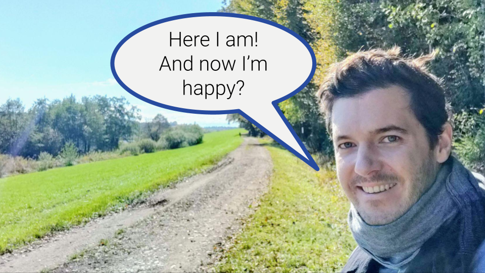

Ideas:

* Radical and maybe seemingly counterituitive idea. But stay with me ...
* Simple explanation of idea: Happiness coming from being you right here right now. That is with everything you sense everything you feel, even if some of it is unpleasant. Just being and having nothing to do.
* Why happiness from doing is far from ideal
  * Story: loosing job
  * all is temporary
* A view that helps me is to distinguish two modes we can be in: Being vs. doing
  * doing mode being part of being mode
  * influence each other
  * but always part of being that is not affected by doing
* Let's assume this is true
  * Implications: don't need job, wealth, buy stuff, achieve things, visit places to be happy
  * 
* How to be?
  * Involves doing and needs training.
  * Essential is to accept and even love yourself
* Being does not mean not doing anything
  * can do everything as before
  * your attitide might just change
  * it is your choice
* Does all of above make sense? What could that mean in practice?
  * Maybe, maybe not
  * Experiencing it for yourself is critical in my experience. I tried to make sense and thought I could, but that did not change anything. Contrary, it made me maybe even unhappier because it did not make me happier^^. It's about experience not making sense.
  * full happiness and contentment likely illusionary for all of us. but what if it helps you to be just let's say 10% happier (mention book)? What if your felt self worth depends just a little less on your job

TLDR: In the western world we define ourselves and others through what we achieve and what we have. We pursue goeals to achieve happiness which is always temporary. A contrary and somewhat idea is that we can achieve happiness and contentment simply via being. This post follows this idea to explore if and how it might actually help us being happy.

## Motivation

The photo shows me, as far as I can remember, actually feelkng very happy. And that is despite the time of the photo was taken being a quite difficult one. 

