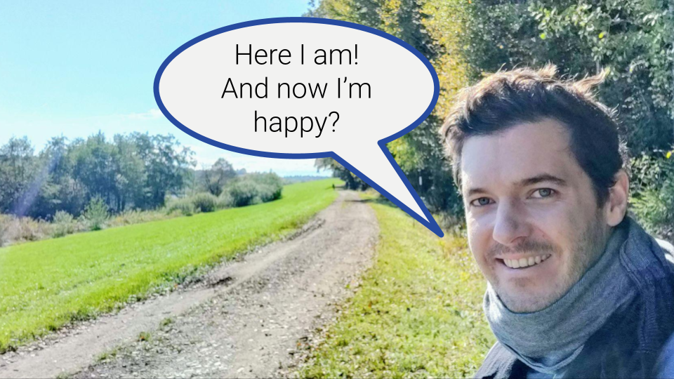

Ideas:

* I'm sceptical
* A thought experiment and seeing what to take away from it
* Radical and maybe seemingly counterituitive idea. But stay with me ...
* Simple explanation of idea: Happiness coming from being you right here right now. That is with everything you sense everything you feel, even if some of it is unpleasant. Just being and having nothing to do.
* Why happiness from doing is far from ideal
  * Story: loosing job
  * all is temporary / changing
* A view that helps me is to distinguish two modes we can be in: Being vs. doing
  * doing mode being part of being mode
  * influence each other
  * but always part of being that is not affected by doing
* Let's assume this is true
  * Implications: don't need job, wealth, buy stuff, achieve things, visit places to be happy
  * 
* How to be?
  * Involves doing and needs training.
  * Essential is to accept and even love yourself
* Being does not mean not doing anything
  * can do everything as before
  * your attitide might just change
  * it is your choice
* Does all of above make sense? What could that mean in practice?
  * Maybe, maybe not
  * Experiencing it for yourself is critical in my experience. I tried to make sense and thought I could, but that did not change anything. Contrary, it made me maybe even unhappier because it did not make me happier^^. It's about experience not making sense.
  * full happiness and contentment likely illusionary for all of us. but what if it helps you to be just let's say 10% happier (mention book)? What if your felt self worth depends just a little less on your job

* Idea of acceptance is crucial
  * What often makes us unhappy is that we want to change the things compared to how they are.
    * I want to be fitter / healther.
    * I want to achieve this one goal.
    * I want to be more productive.
    * ... I want to be happy.
  * We often think that we'll be happy or at least happier once we achieve this and that.
    * I just need to solve this one problem.
    * I will be happy when I can go shopping, when I watch TV.
    * I will be happy when I have this car / house.
    * I will be happy when I have kids.
  * The basic idea is that we don't need to change anything to be okay.
  * But there are things I want to achieve and things I want to be different.
    * Sure, and that's fine. Both can be at the same time.
  * Wouldn#t it be better to accept what I can change and to change what I can and want to change?
    * Sure, but you can still accept what you can change.
    * It is very relieving.
  * Alright, I am accepting what is, but I still don't feel happy.
    * That's okay. Thius needs training.
  * But when will I be happy?
    * Once you allow yourself to be happy.
  * Don't accept to become happy, accept to be and to allow yourself to be the way you are.
  * Let go of the goal to be happy. You don't become happy, because you want to be. You become happy, because you allow yourself to be and because you accept yourself the way you are.
    * This is an inherit conflict between how we generally do / approach things and how this works.
  * Just allow yourself to be the way you are and to accept yourself, your feelings and everthing that is as it is.
  * But won't I loose the willigness and drive to change things?
    * No. Why would you.
    * Most people think so, because we are so driven to do stuff and change stuff.
    * Our society is heavily programmed to achieve things via doing things. Do x and you achieve y. In order to become y, you need to do x.
  * Watch out for thoughts like: I must. I should. I want to. These are indicators for doing things to achieve something.

https://www.theatlantic.com/magazine/archive/2022/03/why-we-are-never-satisfied-happiness/621304/
* idea that satisfaction = getting what you want
* always slips away, never lasting, hedonic treadmill
* dissatisfaction designed by natural selction to keep us moving forward?
* Satisfaction = what you have ÷ what you want
* secret is to manage our wants

book about evolutionary psychology
* brains are not made to make us happy

critical
* https://www.theguardian.com/lifeandstyle/2019/jun/14/the-mindfulness-conspiracy-capitalist-spirituality
  * about the self focused not being able to change the world
* book that criticises non judgement
  * we're always judging. true.
  * I interpret non-judgement in terms of not actively pursuing judgement when meditating. Helps to be open and curious. Also in life it helps to not actively judge certain things right away.

**TLDR**: 

## Motivation

Original photo by Thomas Lieb. Made in Styria, Austria

The photo shows me, as far as I can remember, actually feelkng very happy. And that is despite the time of the photo was taken being a quite difficult one. 

