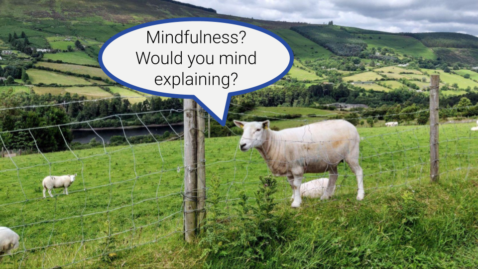

**TLDR**: 

 
 Original photo by Thomas Lieb taken in Ireland on the beautiful <a href="https://www.dublinmountains.ie" target="_blank">Dublin Mountains Way</a> 

Mindfulness has become an important topic for myself in the last year. Here, I wanna share a bit more about my story and my views on mindfulness. I myself attribute huge benefits to mindfulness. And I want to do my bit in sharing these with others to maybe help someone out there. Moreover, there seem to be many misconceptions about mindfulness. Hopefully, I can help to clear some of these up as well.

# Mindfulness?

Before diving into my story (will be a separate blog post), I'd like to give you some high level insights into my understanding of mindfulness. That is, as I feel there are not only misconceptions, but very different understandings of what mindfulness is.

# What is mindfulness?

I do like the following definition of mindfulness:

> *Being aware of what is happening while it is happening*  
> (source TBD)

Before going into more details, I wanna be clear that mindfulness is not about esoteric or new age stuff. It may be used in such concepts, but mindfulness per se is mostly simply about being aware of what is happening while it is actually happening. As simple as that. And still very powerful, at least in my experience.

## Mindfulness & Meditation

## Core concepts

To give a better idea about mindfulness, I think that it is very helpful to talk a bit about some of the concepts that I believe to be important for mindfulness:

-   Awareness
-   Acceptance
-   Compassion
-   Presence
-   Non-judging

Let's look at each in a bit more detail. Before doing so, I wanna be clear that I believe that "achieving" each of these concepts is extremely hard.

### Awareness

I think of awareness as experiencing things that are happening. It is not necessarily thinking about something, but more about noticing in a conscious way.

Let's say you are walking down the street. I think of awareness in that situation to consciously experience what is happening. That may be the fresh breeze on your skin, the anticipation of coffee from your favorite coffee shop or the thinking about your dinner with friends last night. There is so much going on in every single moment, thus there is so much opportunity to be aware of things.

Awareness, allows me truly to experience what is happening. And it allows me to respond in the moment as opposed to merely react without even really realizing.

A key part is the ability to be aware of what is happening in the moment. I do not want to always be focused on the moment, but I want to be able to. It is very easy to be lost on thoughts about the past or the future. What do I wanna eat for lunch? Why did my partner say that thing yesterday? And it is fine to be lost in thoughts.

I'd say awareness is a great skill for all aspects of life. And I see this reflected as so many books of various categories talk about the benefits of awareness. Let's say I am on a date with my wife. I find it very enjoyable to be in the moment and experience the joy of having quality time and eating nice food. Or what if I am interviewing for a job. It is certainly helpful to be aware of my emotions and to be able to respond to them. Awareness, allows me truly to experience what is happening. And it allows me to respond in the moment as opposed to merely react without even really realizing.

### Acceptance

Acceptance is very interesting. In the past I was thinking of acceptance, especially of "bad" things, as not wanting to change things. To me that is reflected in phrases like *"Your behavior is unacceptable.".* This has a very different vibe than *"I accept your behavior"*.

But today I rather think about acceptance as acknowledging that something is and allowing myself to be okay with the fact that something is. That does not mean that I have to be okay with the fact.

On reading this, it may become obvious that acceptance in the context of mindfulness may have a different meaning from the common understanding. "Accepting that war is happening" sounds very odd. A better way to communicate the meaning may be "acknowledging". "Acknowledging that war is happening" sounds much closer to what I mean. In addition, I can accept that war makes me feel angry, sad, powerless or frightened.

Acceptance does not mean that I can't or won't do anything about it. I can accept and still speak up or work on improving a situation. In contrary, I would argue that acceptance empowers me to do something about things much more if I would not accept. For example, accepting a mistake I made puts me in a better position to apologize and do better in the future.

### Compassion

Compassion can be thought of as empathy plus the desire to help. I have also read about compassion as "deep caring without attachment" (book "Mindful Leadership"). This is similar to [Brené Brown](https://brenebrown.com/art/atlas-of-the-heart-boundaries-are-a-prerequisite-for-compassion-and-empathy/) emphasizing the importance of *boundaries* in compassion.

I think of compassion as being able to feel what a living being might experience, caring about their experience while time keeping a healthy distance and wanting to help. Keeping a distance might mean for example making a clear distinction between your own feelings and those of others. And that sounds easier as it actually is.

Compassion is important in mindfulness, as it helps to connect with others and their reality. To me this is a key part. We as humans being are social beings. Truly being aware of ourselves is only possible if we are aware of the relationships with others as well as their experience. But it is not just about awareness, it is about accepting them as their experience, caring about them and in the end wanting to help them. Mindfulness without compassion is a bit like a meaningless empty shell.

Compassion includes self-compassion. I think of how to be compassionate to myself as how someone that truly cares about me would be compassionate towards myself.

Here, I do want to be clear that I do not think that compassion is better than empathy. These are different, but related concepts. Specifically, the desire to help can even be counterproductive. For example, when we listen to a close friend struggling, we feel the urge to help and fix the problem. However, I believe that very often people just want to be heard, that is they want empathy.

### Presence

Presence or being present is at the core of mindfulness, as it is a requirement for awareness.

To me, presence might be best described by the idea of being-mode. I came across these concepts as I was reading about MBSR - Mindfulness Based Stress Reduction[^1]. The authors made a difference between doing-mode and being-mode. And I think the meaning is well described by this quote from Zindel Segal, one of the authors[^2]:

[^1]: "The Mindful Way through Depression" by John D. Teasdale, Zindel Segal, J. Mark G. Williams, Jon Kabat-Zinn

[^2]: <https://www.mindful.org/difference-between-being-and-doing/>

"Doing mode involves thinking about the present, the future, and the past, relating to each through a veil of concepts. Being mode, on the other hand, is characterized by direct, immediate, intimate experience of the present."

We typically spend most of our time in doing-mode and do not learn how to just be. Just imaging your last sightseeing trip where you were looking at one sight. Were you truly present and experienced what is? Or maybe did you think about what to do next?

I believe that both modes are very important. Doing-mode brought us as humans very far. At the same time, I find just being very healthy and very important.

### Non-judgement

## Related ideas

-   Curiosity
-   Non identification: not automatically
-   Non attachment
-   Kindness

# Why?

# Are you sure?

# More

## Awareness

?Blog post name?  
Keen on knowing what is happening with yourself? Try awareness

I'd say the core of mindfulness is awareness. This is well conveyed by the following definition of mindfulness:

> *Being aware of what is happening while it is happening*  
> (source TBD)

This may sound incredibly simple and as a concept it is. But it is by no means easy to do. Let me give you an example to showcase how much there is to be aware of in every single moment of life. Let's say you are walking down the street in the morning. You got up late and you are late for work. This may case many emotions like stress because you don't want to be late. You might be angry at yourself because you woke up late again. You may also be angry at your flatmate because he occupied the bathroom for 30min. You might also be worried because of that assignment due today that is not yet finished. You want to get it right, because you think this to be very important for a promotion that you are keen about. You might also be thinking about the date you had last night and wondering what impression you made. There might also be cars, bikes and other pedestrians passing by. There might be a mix of clouds and clear sky and some dark clouds on the horizon. Maybe there various birds around chirping and going minding their morning routine. And there may be so much more. But do you think that you'd be aware of all of that?

One very important aspect of awareness is being vs. doing. Just think about above the situation walking down the street. Usually, while walking, we are thinking about what to do about stuff in the future, e.g. the work assignment, or things in the past, e.g. the date. This state of wanting to do something, about achieving goals or rumination is called *doing mode*. In doing mode one typically want to do something. On the contrary, in *being mode* one is experining the present moment. That might be sensations like temperature, a breeze on your skin, birds chirping and so on. Thus, basically "raw" sensations through ones senses. By "raw" I am referring to the sensation e.g. of the sound itself. That is as experiences trigger a lot of reactions like interpretations, memories, bodily sensations or emotions. For example the sound of a bird chirping. Identifying the sound as a bird chirping is already an interpretation. At the same time, this may make you feel comnfortable, it might remind you of last summer when you were sitting in a park and so on. But being also includes experiencing ones emotions or thoughts. There is an extremely experience rich world happening in every moment inside and outside yourself.

Being and doing mode are complementary. It is not about one being better than to other or just focusing on one over the other. I believe that it is rather important to be able to be able to keep them in balance. Both are have their place and both are very useful. But loosing touch to one of them can easily lead to being out of touch with the world including yourself. I would argue that in today's world we are having a strong focus on doing mode. Being mode is something I have rarely encountered in my life so far, that is at least before I started mindfulness meditation. TBD

Being mode can be very hard to understand in today's world. And it can be very easy and tempting to approach being mode and mindfulness overall with a doing mindset.

There are different types of awareness. One way to categorize is (source: Institute of you, TBD):

-   Self awareness
-   Social awareness
-   Organisational awareness

But there are also different types of self awareness. One categorization I came across is from the book "Executive Presence" by ... (search for "Eurich", TBD):

-   External self awareness
-   Internal self awareness
-   Strategic self awareness

I wanna call out that awareness and esp. self awareness ist not just to have. Self awareness is a skill that comes with huge benefits. It basically gives you the possibility to respond to what is happening rather than just reacting. Think for example about a customer at a hotel reception screaming and shouting at the receptionist because they are unhappy with their room. Most likely that person is just reacting and being led by their emotions. With self awareness they could have observed that they feel anger enabling them to decide what to do next. A person could decide to take some time to calm down, to breathe and to think about what they want to do next to resolve the situation they are in.

Being aware of your own emotions and allowing you to respond is huge in itself. But self awareness can help you with many other aspects like realizing own biases, observing your own habits, observing how you communicate, how you make decisions, what actually makes you happy and fulfilled, how experiences and memories shape our decision making and a lot more. If you wanna hear more about the advantages of self awareness, please leave a comment.

:bulb: Example idea

The idea of awareness is certainly not to be aware of everything all the time. First, it is unrealistic to be aware of everything. And it is not helpful to focus on awareness all the time. But awareness is something you can train and that can become an unconscious as well as conscious habit. TBD

This is some highlighted example text.

bla bla

## Meditation

Meditation is closely related to mindfulness. In my understanding meditation is a practice that can be used to train being mindful. In other words, meditation can be used as a practice and training of the mind and the brain.

Mindfulness meditation is, in my understanding, a special form of meditation.

Ambiguity of meditation.

To me the practice and training part is very important.

## Philosophy

-   relationship to buddhism
-   we are all interconnected
-   overestimating the importance of self (ego)
-   Helping yourself to help yourself
-   joy of the moment
-   creating space
-   Empathy and compassion
    -   consequences of actions on others
-   Big picture
-   suffering?

## What mindfulness is not

# Mindfulness & Meditation

# My story

# Ideas

-   How to interpret what I write about mindfulness
    -   Share a mix of my experience and what I read about. Beginner. Helps me make sense of it. I'm sure I'll get many things wrong or at least not 100% correct, but that's not the goal.
-   What is mindfulness
    -   Being aware of what is happening while it is happening
-   My experience with mindfulness
    -   How I started
        -   I'm critical
    -   Getting sick
    -   Dealing with uncertainty, pain and myself
    -   Getting back to work
    -   Reading / listening to books
    -   Daily practice
    -   MBSR course
-   Why mindfulness?
    -   10% happier
    -   Awareness is important
    -   Getting to know yourself better
    -   Responding vs. reacting
    -   What research shows
-   Still sceptical about mindfulness?
-   Mindfulness misconceptions
    -   Mindfulness is not about not thinking or reducing emotions
-   Important concepts in Mindfulness
    -   Awareness
    -   Sensations: Physical, emotional, thoughts
    -   Curiosity
    -   Non identification
    -   Non judgement: not automatically (talk also about non-judgement / judgement)
    -   Doing mode & being mode
    -   Pain vs. suffering (suffering = pain and resistance)
    -   Compassion
-   How to start with mindfulness
    -   Self paced or course
    -   Some challenges in mindfulness
        -   also from MBSR course
-   Books I like

# Introduction

-   How to interpret what I write about mindfulness
    -   Share a mix of my experience and what I read about. Beginner. Helps me make sense of it. I'm sure I'll get many things wrong or at least not 100% correct, but that's not the goal.

In this post I wanna give you an introduction to mindfulness.

# What is mindfulness?

-   What is mindfulness
    -   Being aware of what is happening while it is happening

# My experience with mindfulness

-   My experience with mindfulness
    -   How I started
        -   I'm critical
    -   Getting sick
    -   Dealing with uncertainty, pain and myself
    -   Getting back to work
    -   Reading / listening to books
    -   Daily practice
    -   MBSR course

Ideas v2

-   I'm critical
-   My story with mindfulness so far
-   Introduction: How to interpret what I write about mindfulness
    -   Share a mix of my experience and what I read about. Beginner. Helps me make sense of it. I'm sure I'll get many things wrong or at least not 100% correct, but that's not the goal.
-   What is mindfulness?
    -   Being aware of what is happening while it is happening
    -   Mindfulness meditation: A very practical approach to training your mind for various essential skills: e.g. self-awareness, compassion, responding to your own emotions, staying calm, ...
    -   Can be a very spiritual thing, but does not need to be
-   What mindfulness is not
    -   Not about getting rid of thoughts or emotions
    -   Not about sitting quietly on a cushion with scents and stuff
    -   Not esoteric or new-age, while mindfulness itself and many of its concepts and ideas are unfortunately used by esoteric or new-age scene
-   What mindfulness can help with
    -   Calm your ego
    -   Access to unconsciousness
    -   Reflection
    -   Responding to emotions
        -   Seeing as pleasant / unpleasant to cetain degree vs. good/bad
        -   Difference between responding to emotion and emotion itself
    -   Self-awareness
    -   Forgiving yourself
    -   Getting to know yourself
    -   Allowing to feel what you feel
    -   Being happy without needing to achieve anything
    -   Understanding the mind
        -   Mind wants to be busy and process information
        -   Thoughts are not reality itself - thoughts are just thoughts based
        -   Understanding and reducing the effect of negative thought patterns
            -   examples
                -   self criticism, perfectionism, high expectations on yourself, wanting things to be different from how they are, not feeling good enough, not feeling worthy (often impostor syndrome), feeling bad about feeling bad, I'll be happy / feel better when this one thing happens (accomplishment, buy something, this one conflict is resolved, ...)
-   5 Hindrances
-   Mindfulness characteristics
    -   Awareness
    -   Curiosity
    -   Non identification: not automatically
    -   Non attachment
    -   Kindness
    -   Compassion (is deep caring without attachment - Mindful Leadership)
    -   Equanimity (from mindful leadership)
-   Mindfulness and science
    -   glimpse into the research
-   Doing mode, being mode
-   talk also about non-judgement / judgement
-   Books I liked and recommend
