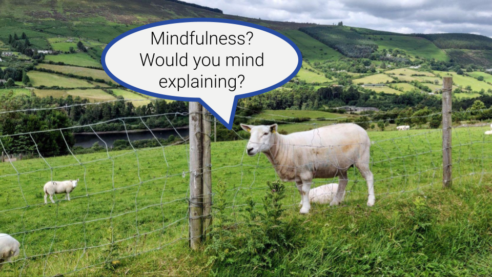

**TLDR**: 

Original photo by Thomas Lieb. Shot on the beautiful <a href="https://www.dublinmountains.ie/dublin_mountains_way/dublin_mountains_way/" target="_blank">Dublin Mountains Way</a>

Ideas
* I'm critical
* My story with mindfulness so far
* Introduction: How to interpret what I write about mindfulness
    * Share a mix of my experience and what I read about. Beginner. Helps me make sense of it. I'm sure I'll get many things wrong or at least not 100% correct, but that's not the goal.
* What is mindfulness?
  * Being aware of what is happening while it is happening
  * Mindfulness meditation: A very practical approach to training your mind for various essential skills: e.g. self-awareness, compassion, responding to your own emotions, staying calm, ...
  * Can be a very spiritual thing, but does not need to be
* What mindfulness is not
  * Not about getting rid of thoughts or emotions
  * Not about sitting quietly on a cushion with scents and stuff
  * Not esoteric or new-age, while mindfulness itself and many of its concepts and ideas are unfortunately used by esoteric or new-age scene
* What mindfulness can help with
  * Calm your ego
  * Access to unconsciousness
  * Reflection
  * Responding to emotions
    * Seeing as pleasant / unpleasant to cetain degree vs. good/bad
    * Difference between responding to emotion and emotion itself
  * Self-awareness
  * Forgiving yourself
  * Getting to know yourself
  * Allowing to feel what you feel
  * Being happy without needing to achieve anything
  * Understanding the mind
    * Mind wants to be busy and process information
    * Thoughts are not reality itself - thoughts are just thoughts based
    * Understanding and reducing the effect of negative thought patterns
      * examples
        * self criticism, perfectionism, high expectations on yourself, wanting things to be different from how they are, not feeling good enough, not feeling worthy (often impostor syndrome), feeling bad about feeling bad, I'll be happy / feel better when this one thing happens (accomplishment, buy something, this one conflict is resolved, ...)
* 5 Hindrances
* Mindfulness characteristics
    * Awareness
    * Curiosity
    * Non identification: not automatically
    * Non attachment
    * Kindness
    * Compassion (is deep caring without attachment - Mindful Leadership)
    * Equanimity (from mindful leadership)
* Mindfulness and science
  * glimpse into the research
* Doing mode, being mode
* talk also about non-judgement / judgement
* Books I liked and recommend
