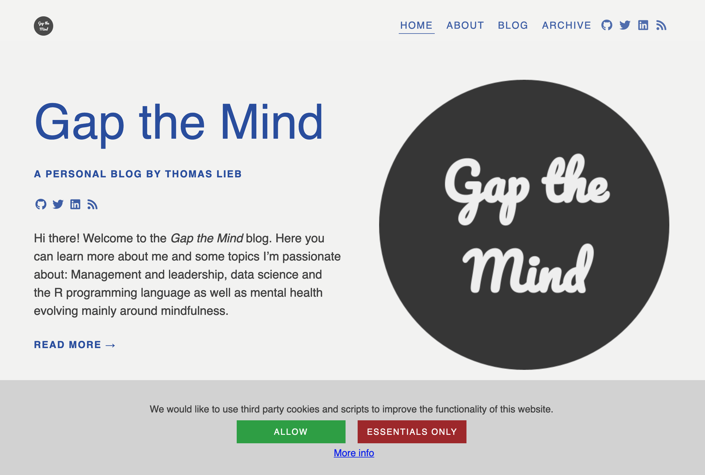
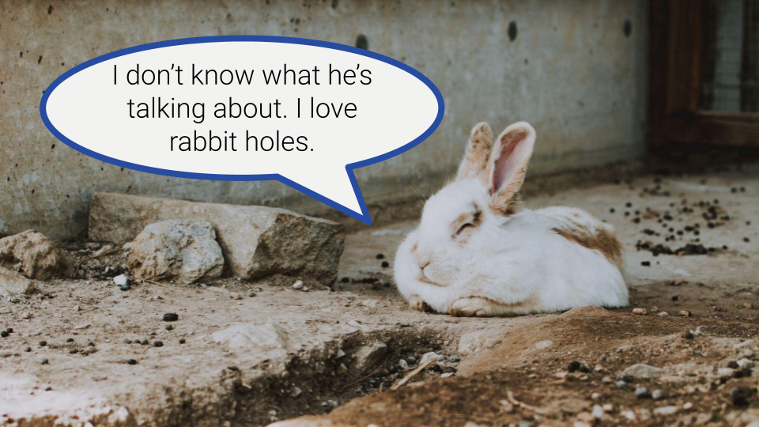

> **Disclaimer**: Nothing I say/write here is legal advice. I do my best to not be wrong, but I am not a legal expert.

**TLDR**: 


<p style="color:grey; font-size:0.7em; margin:0;">
Original photo by <a href="https://unsplash.com/@braydona?utm_source=unsplash&utm_medium=referral&utm_content=creditCopyText">Braydon Anderson</a> on <a href="https://unsplash.com/s/photos/privacy-fun?utm_source=unsplash&utm_medium=referral&utm_content=creditCopyText">Unsplash</a>
</p>


## Blogging and data privacy? Sounds boring

> "Data privacy is challenging since it attempts to use data while protecting an individual's privacy preferences and personally identifiable information." <br>([Wikipedia](https://en.wikipedia.org/wiki/Information_privacy))

Data privacy is not only challenging but also very important, especially in the online world. We all want our own data to be well protected and treated with care. That is especially the case when it comes to very sensitive data like health records or credit card details. But also data on which websites we visit would not be great to float around freely accessible on the internet.

Whilst there are many [tips on how to stay safe on the web](https://support.mozilla.org/en-US/kb/how-stay-safe-web), also lawmakers [started tackling online privacy](https://en.wikipedia.org/wiki/Information_privacy_law). When I started blogging, I suddenly found myself on the side of a website provider being responsible for any data collected on my blog. Slowly, I started to realise that this raises many questions. What do I need to do? What can't I do? What am I responsible for?

All of that sounds quite boring. At least to me. And, when I started digging into the topic, it was actually getting more and more boring. However, it is very important. Not only for me as a blogger but more importantly, as I have a responsibility towards everyone visiting my website.

## What to watch out for

There is a lot to potentially watch out for. And if you wanna be on the safe side, you might want to consult a lawyer. That is especially true if you earn money from your blog.

In my case, I am hosting a website using the Hugo framework, which creates a static website. A static website is a website "that is delivered to the user's web browser exactly as stored, in contrast to dynamic web pages which are generated by a web application" ([Wikipedia](https://en.wikipedia.org/wiki/Static_web_page)). This makes my case simpler, as I am not collecting any data myself. In my understanding, I primarily need to watch out for any third party Javascript-based content I am embedding.

Here are some examples I came across:

* Embedded GIFs
* Twitter cards
* Youtube videos
* Google Analytics

## What to do

This is the very tricky part. In the end, what to do depends on many factors like the type of embedded content, the country you are based in or the country of your users. In short: It's complicated.

<p style="margin-bottom:0;"><a href="https://imgflip.com/i/652hj2"></a></p>
<p style="color:grey; font-size:0.7em; margin:0;">
<a href="https://imgflip.com/memegenerator" target="_blank">from Imgflip Meme Generator</a>
</p>

*Side note: I studied mathematics. So the above Meme is not that far from what I did back in university. That is except for the suite. So, from my perspective, data privacy laws are actually much more complicated than math.*

### The simple solution

The simplest solution to me seems to be to not collect any data at all. That is not by myself and not by any third party. For a static website, this means not embedding any third-party content that is tracking data. Sounds easy. The challenge is that this approach comes with limitations. For example, not using any website analytics tool means that you can't see how many people read your blog posts and it's a lot harder to know which posts people are most interested in. Not embedding social media postings or GIFs means fewer opportunities to loosen up your content.

When using Hugo, there are actually some very easy and great ways how to still embed third party content without having them track data. By setting a few parameters you can control privacy settings for popular third party content like Google Analytics, Instagram, Twitter, Vimeo or Youtube. See [here](https://gohugo.io/about/hugo-and-gdpr/) for more info. For some third parties, Hugo actually offers a `simple`-mode, which means that Hugo creates a pure HTML version of the content that does not come with any tracking. I am not 100% sure, but these settings may only apply when using [Hugo's Shortcodes](https://gohugo.io/content-management/shortcodes/#tweet). Here is an example for Twitter.

The shortcode:

```markdown

```

The rendered result:



### The not so simple solution

When you do want to use third party content, things get a bit trickier. It is my understanding that when the EU's [GDPR](https://en.wikipedia.org/wiki/General_Data_Protection_Regulation) (General Data Protection Regulation) applies, the user needs to explicitly consent to data collection using cookies before it happens. Not just that, the user also needs to be informed about what data is collected and for what reasons. If data is collected, the user needs to be able to access the data about the user being stored and needs to be able to request for it to be deleted. One result of this is that we see a lot of cookie consent banners on websites.

Implementing cookie consent banners on a static website is actually not that easy. Initially, I did implement a cookie banner for Google Analytics, which I'll describe in a bit. 

However, two recent court rulings in Austria and France found that specific websites [cannot use Google Analytics because it transfers personal data to the United States in breach of EU privacy law](https://www.politico.eu/article/french-privacy-regulator-rules-against-use-of-google-analytics/). The French data privacy regulator stated that measures from Google ["are not sufficient to exclude the accessibility of this data to U.S. intelligence services"](https://www.reuters.com/technology/french-watchdog-says-google-analytics-poses-data-privacy-risks-2022-02-10/). You can also read on [Wikipedia about privacy concerns](https://en.wikipedia.org/wiki/Privacy_concerns_regarding_Google). Google [responded](https://blog.google/around-the-globe/google-europe/its-time-for-a-new-eu-us-data-transfer-framework/) via highlighting the need for a "new EU-US data transfer framework".

I am not too deep into the data privacy topic, but for me, the aforementioned aspects create enough uncertainty to decide on not using Google Analytics or any other online analytics tool for now. I'd love to know how many people visit my blog, but not at the risk of violating the data privacy rights of my readers. **So, please leave comments and reach out instead :smile:**

#### Cookie Consent Banner

In case you need/want to leverage a cookie consent banner, I still wanna share my approach. My approach involves consent to Google Analytics. But I guess similar things can be done with any cookie that can be activated or deactivated using Javascript.

I was actually following a [blog post on the LittleBigTech blog](https://littlebigtech.net/posts/hugo-gdpr-cookie-consent-banner/#process) (also created with Hugo). All it involves is basically creating a partial HTML file for the cookie banner, integrating it into the Hugo layout and creating a privacy page.

The HTML file `cookie-consent.html` basically holds the cookie banner along with Javascript doing a few things:

* Creating an essential cookie to store the user's agreement or disagreement with cookies. It seems weird that a cookie is needed to decide on cookies. But the created cookie is in my understanding an "essential" cookie that does not hold any personally identifiable information. In my understanding [essential / strictly necessary cookies](https://gdpr.eu/cookies/) are always fine to be stored.
* If the user agrees, it creates the Google Analytics cookie.
* If the user disagrees, it removes the cookie banner and does not create a Google Analytics cookie.

The LittleBigTech blog post has a template for the HTML file. The blog post also has CSS to style the banner. In my case of the Apéro Hugo theme, I could not find a CSS file to add to. So, as suggested I added a bunch of style tags in my HTML file, which you can find [here](https://github.com/rietho/blogdown_website/pull/6/files#diff-90b6e61439c65204a847f8a025e2919732907c8ae0f4358a156c48ad3aadedc3).

With that, you just need to modify the head.html file as described on the LittleBigTech blogpost. And you might want to create a privacy page to link to for more information. [Here](https://github.com/rietho/blogdown_website/pull/6/files#diff-b7552d23ec1f2f9e2b56fe89197d049963c7c9ef6e0d09b2f3fe3f568ff21605)'s the one I had created. Just be aware that what I wrote about Youtube does not seem to be accurate (see [here]()).

Here's a screenshot of what my banner originally looked like:



I like my cookie consent banner. That is especially because I designed it to be fully transparent and clear to the user. Also, I'm not trying to steer the user in one direction. The red and green button colours are supposed to make it easy for the user to decide what they actually want.

In my case, I did not dive too deep into what is possible and not possible. In my research, I found some ways how to adjust the Google Analytics cookies based on the user's consent decision. [Here](https://developers.google.com/tag-platform/devguides/consent)'s a general article about managing consent settings and [here](https://support.google.com/analytics/answer/9976101?hl=en)'s one about consent mode. [Here](https://www.simoahava.com/analytics/consent-mode-google-tags/)'s also a related blog post. Google started to implement cookieless pings. My understanding is that information that cannot be related to the concrete user is sent to Google to allow website analytics based on data modelling. I might look more into that at some point in the future.

## Things to watch out for

As I went on my journey to make my website GDPR compliant (I do really hope it is now), there were a lot of things I learned. I wanna call out a few things that I'd like to share:

* The Youtube privacy-enhanced mode using the URL `https://www.youtube-nocookie.com` seems to use cookies, which is obviously in contrast to the name. For one, I did see cookies being placed on page load. But to be honest, I did not look into what these cookies are actually doing. Some [blogs suggest that using the privacy-enhanced mode is GDPR compliant](https://cookie-script.com/blog/how-to-add-youtube-videos-without-cookies), while [others suggest the contrary](https://axbom.com/embed-youtube-videos-without-cookies/). I am going on the safe side here with not embedding Youtube videos since I did not want to go into more details. At least for now.
* The Hugo Youtube `privacyEnhanced` setting is simply using the privacy-enhanced mode just described.
* GIFs embedded from Giphy seem very innocent. At least they seemed so to me. However, they do come with cookies.
* You can inspect all cookies saved in most if not all browsers. [Here](https://developer.mozilla.org/en-US/docs/Tools/Storage_Inspector/Cookies)'s how to do so in Firefox.

## Wrapping up

Staying legal when creating a website is quite a complex topic. I am doing my very best to adhere to all regulations as I hopefully demonstrate in this post. The first topic I did actually come across was licensing of visual content (see my [blog post here](/blog/2022/01/30/how-to-set-up-your-own-blog-using-r-and-blogdown/#licencing-of-images-gifs-videos-and-memes-on-your-blog)). Once I came out of that rabbit hole, I thought: "That was tough and boring. But at least I found what seems a good and practical solution. Now I can focus on writing blog posts."

But obviously, I was wrong, as I stumbled across data privacy. There I spent a few hours creating my beautiful cookie consent banner. Again, I thought: "That must have been it. Let's blog now. Let's actually share my experience on data privacy." But as I wrote this post, I decided to not use Google Analytics or embedded Youtube videos as there are too many open questions for me. So, I took back my cookie consent banner, disabled Google Analytics, but at least ended up with this post. But who knows what the next rabbit hole will be that I end up in.


<p style="color:grey; font-size:0.7em; margin:0;">
Original photo by <a href="https://unsplash.com/@lilartsy?utm_source=unsplash&utm_medium=referral&utm_content=creditCopyText">lilartsy</a> on <a href="https://unsplash.com/s/photos/rabbit-hole?utm_source=unsplash&utm_medium=referral&utm_content=creditCopyText">Unsplash</a>
</p>

I hope someone finds it useful to read about my experience. If so and even if not, I'd love to hear your thoughts in the comments or via social media.
