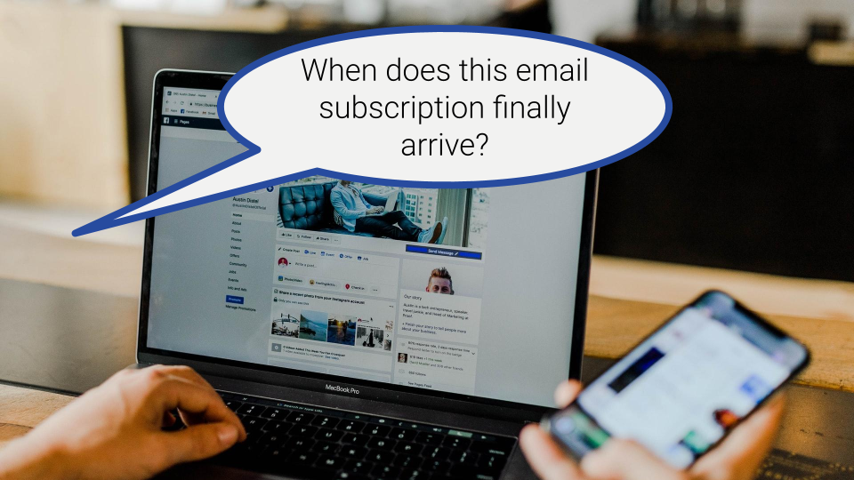

**TLDR**: 

Original photo by <a href="https://unsplash.com/@austindistel?utm_source=unsplash&utm_medium=referral&utm_content=creditCopyText">Austin Distel</a> on <a href="https://unsplash.com/s/photos/email?utm_source=unsplash&utm_medium=referral&utm_content=creditCopyText">Unsplash</a>

* helpful to notify readers abot new blog posts
* explored a few options. share with others
  * have them write you about wanting to subscribe (form, email address, ...)
    * manually sending emails
    * offering to unsubscribe via email
  * ask them to sign up via an RSS to email service: https://www.ilovefreesoftware.com/14/featured/free-rss-to-email-services-to-get-rss-feed-updates-emailed-to-you.html
  * integrate email subscription into your blog: various services
* my experience with mailerlite

# Why email subscriptions anyway?

# What are my options?

# My experience

# Summary

